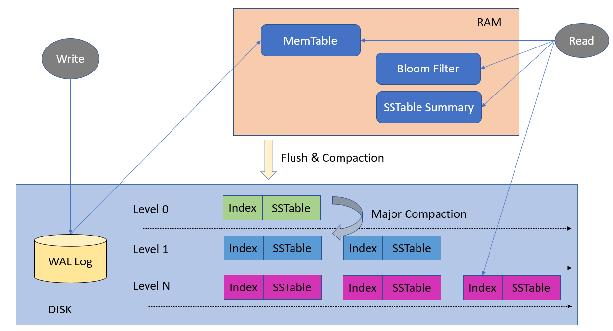
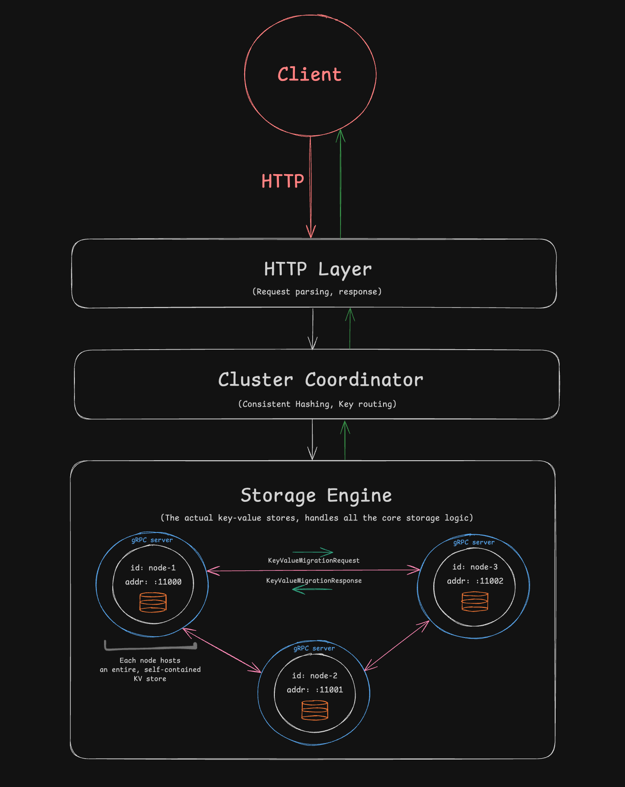

# genesis

**Table of Contents**
1. [About](#about)
2. [Example Usage](#example-usage)
3. [Architecture](#architecture)
   1. [Memtable](#memtable-red-black-tree)
   2. [SSTable](#sstable)
      1. [Compaction](#compaction)
   3. [Write-Ahead-Log](#write-ahead-log)
   4. [Distributed Architecture](#distributed-architecture)
4. [Complete Tree](#complete-Tree)
5. [Benchmarks](#benchmarks)
   1. [Full Tree](#full-tree)
6. [Feature Checklist](#feature-checklist)
7. [References](#references)

# About
genesis is a distributed log-structured merge (LSM) tree key-value store. This project was originally based off the Bitcask research paper (which isnt distributed nor uses LSM), but expanded upon and redesigned.
Built purely for educational purposes.

# Example Usage

### Quick Start

Clone the repository locally. 

As a pre-equisite, you will need to generate the message types and grpc service code using protoc.

You may need to install below dependencies to be able to run the command:
- Ensure you have Go installed and it is configured. You can test using "go version"
- protobuf (e.g. on Mac, you can use "brew install protobuf")
- protoc-gen-go (e.g. go install google.golang.org/protobuf/cmd/protoc-gen-go@latest)
- protoc-gen-go-grpc (e.g. go install google.golang.org/grpc/cmd/protoc-gen-go-grpc@latest)


To get started, you can run below target from the Makefile
```
make all
```

By default, the system will open a cluster with **5** nodes (self-contained KV stores). You can modify this within the `main.go` file.
```go
c := store.NewCluster(5)
c.Open()
```
This will start an HTTP server on port `:8080`, which is what you can use to put, get, or delete keys.
As for the nodes themselves, they are hosted starting from port `:11000` to `:11004` in the case of 5 nodes.


> [!NOTE]
> Keep in mind that the nodes themselves at the aforementioned ports **do not** accept HTTP requests, as this would bypass
the consistent hashing & routing layer. Instead, any request must go through port `:8080`.

### Put, Get, Delete key-value pairs

To Put, Get, or Delete key-value pairs, you can start genesis in the terminal and in another terminal tab, you can use `curl` in the following manner on `:8080/key`:
```
curl -XPOST localhost:8080/key -d '{"user1": "batman", "user2": "superman", "user3": "captain america"}'

curl -XGET localhost:8080/key/user2
-> superman

curl -XDELETE localhost:8080/key/user3
```

On the other terminal tab, you will see print statements to confirm the operations:
```
key = user1	added @ node addr = :11004
key = user2	added @ node addr = :11001
key = user3	added @ node addr = :11003
deleted user3 @ node addr = :11003
```

### Add additional nodes
To add additional nodes and actually see the data redistribution in action, we can first add 50 key-value pairs:
```
curl -XPOST localhost:8080/key -d '{
    "user1": "batman", "user2": "superman", "user3": "captain america",
    "user4": "ironman", "user5": "thor", "user6": "hulk",
    "user7": "black widow", "user8": "black panther", "user9": "spiderman",
    "user10": "scarlet witch", "user11": "vision", "user12": "doctor strange",
    "user13": "antman", "user14": "hawk eye", "user15": "winter soldier",
    "user16": "falcon", "user17": "loki", "user18": "nick fury",
    "user19": "gamora", "user20": "star lord", "user21": "drax",
    "user22": "rocket", "user23": "groot", "user24": "mantis",
    "user25": "wong", "user26": "shang chi", "user27": "kamala khan",
    "user28": "moon knight", "user29": "blade", "user30": "deadpool",
    "user31": "jessica jones", "user32": "luke cage", "user33": "iron fist",
    "user34": "the punisher", "user35": "daredevil", "user36": "x23",
    "user37": "quicksilver", "user38": "vision", "user39": "scarlet witch",
    "user40": "mister fantastic", "user41": "invisible woman", "user42": "human torch",
    "user43": "thing", "user44": "wolverine", "user45": "storm",
    "user46": "cyclops", "user47": "beast", "user48": "nightcrawler",
    "user49": "colossus", "user50": "gambit"
}'
```
And then add an additional node, which automatically triggers data redistribution over the wire using gRPC:
```
curl -XPOST localhost:8080/add-node
```

And in the other terminal tab, you can see all the operations being printed including some lines that detail the data migration request.

### Removing nodes
To remove a particular node, you can use the following curl command:
```
curl -XPOST localhost:8080/remove-node/11004

or more generally:
curl -XPOST localhost:8080/remove-node/<node_address>
```

To exit the entire system, simply press `CTRL + C` on your keyboard.


# Architecture
Overview of the architecture, from the Memtable implementation, to how the data is stored on disk in the form of SSTables, and lastly how its distributed.


Source: “A Survey of LSM-Tree Based Indexes, Data Systems and KV-Stores.” arxiv.org/html/2402.10460v2.

## Memtable (Red-Black Tree)
A [red black tree](https://en.wikipedia.org/wiki/Red%E2%80%93black_tree) is a self-balancing binary search tree (BST) with a couple distinct properties to ensure the tree remains balanced and maintains efficient search, insertion, and deletion operations in O(log(n)) time.

In this LSM tree implementation, a red-black tree is used as the memtable—which is the **in-memory** portion of this database in which all incoming writes are temporarily stored before being flushed to disk. Flushing to disk involves taking every record in the memtable and storing it in a Sorted String Table (SSTable) on disk, which is a process triggered under a defined threshold. This batching approach allows for much greater efficiency, as it minimizes costly disk writes.

As there's a natural, sorted ordering to elements in a BST, it makes a lot of sense to use a red-black tree when creating *Sorted* String Tables coupled with the performance gains of a self-balancing BST.

## SSTable
An SSTable (Sorted String Table) is a file format used for storing key-value pairs in a sorted order. It is commonly used in systems like LevelDB and Bigtable for efficient data storage in key-value stores.

**Components:**
- Data: all the key-value pairs in sorted order (by key) in a .data file
- Sparse index: index structure that stores a subset of the original keys and their corresponding byte offsets in the data file
- Bloom filter: a _probabilistic_ data structure used to test the membership of a given key in the SSTable

SSTables are **persisted** to disk immediately when created, and each table is represented by three files:
- <sst_num>.data
- <sst_num>.index
- <sst_num>.bloom

To **lookup a key**, the system will automatically look in the memtable first to check if they key is still in-memory and hasn't been flushed yet. If the key is not present in the memtable, then we start looking at the SSTables on disk. 
The general process to find a key on disk is the following:
- Use the bloom filter to check if a key _may or may not_ be in a given SSTable
- If the key is present, utilize binary search + the sparse index structure to find the maximum lower bound of the target key
- Scan every key-value pair starting from that offset until either 1) the key is found or 2) the scan overextends
- Repeat process until the target key is found

### Compaction
To improve overall performance and efficiency, genesis implements a [size-tiered compaction strategy](https://cassandra.apache.org/doc/stable/cassandra/operating/compaction/stcs.html) based off Apache Cassandra. This process merges multiple tables found within a bucket into 1 bigger, most-recent table. Essentially, it removes all outdated entries, performs garbage collection, and frees up disk space.

Compaction is automatically triggered when the memtable reaches a defined byte threshold.

## Write-Ahead-Log
genesis supports write-ahead-logging (WAL) to improve durability and serve as a **crash recovery** mechanism in the face of network faults. Upon each operation (put, get, delete), metadata (such as the operation) and other info such as the key/value is appended to an auto-generated .log file which can be used to reconstruct the state of the tree in the case of a crash. 

# Complete Tree
The complete tree is the seamless combination of the Memtable and SSTable component. When combined, we effectively have an in-memory component and a disk component. LSM trees were designed to emphasize **write performance**, which is also seen with genesis.

genesis supports the following operations:
- Put(key, value)
- Get(key)
- Delete(key)

> [!NOTE]
> Genesis utilizes **tombstone-based garbage collection**. When deleting an existing key, it will simply append a tombstone value in the header and re-add it to the memtable (which will eventually get flushed to disk). The _actual_ deletion process occurs in the SSTable compaction algorithm.

# Distributed Architecture
This key-value store is made to be distributed through the use of data partitioning and **sharding**. Each node of this system
is a self-contained key value store (i.e., a shard), where each node holds a _subset_ of the overall data and is hosted on a separate port. Anytime a key value pair is inserted
to the system by a client, it goes through a routing layer that utilizes [consistent hashing](https://en.wikipedia.org/wiki/Consistent_hashing) and is then routed to the correct node—thus
achieving **consistent** data partitioning.

Genesis can support a multitude of concurrent nodes and utilizes [gRPC](https://grpc.io/) for inter-node communication, primarily in the case of
**data rebalancing** (triggered when a node is added or removed). Each node is wrapped in a gRPC server to accept incoming requests, and gRPC clients are spawned (to set up traditional client-server comms) only when data migration is needed. 

A high-level overview of the overall design:


# Benchmarks

**Each benchmark is ran 3 times and the average is shown below**
<br>Operation count is dynamically allocated for some of the benchmarks
### Full Tree
- Put: insert 1,000,000 distinct kv pairs to the tree
- Get: get 1 key in an SSTable w/ 1,000,000 kv pairs
```go
goos: darwin
goarch: arm64
cpu: Apple M3 Pro

BenchmarkDiskStore_Put-12    	 1000000	     9740 ns/op	         104464 ops/s
BenchmarkDiskStore_Get-12    	13266362	    77.84 ns/op        12846082 ops/s
```

### Memtable
- Put: insert 1,000,000 distinct kv pairs to the memtable
- Get: get 1 key in a memtable w/ 1,000,000 kv pairs

```go
goos: darwin
goarch: arm64
cpu: Apple M3 Pro

BenchmarkMemtable_Put-12    	  1000000	      9608 ns/op	    104081 ops/s
BenchmarkMemtable_Get-12    	 11267596	     105.7 ns/op	   9464848 ops/s
```

# Feature Checklist
Features in the works:
- [x] Serialize/Deserialize header + key, value
- [x] Store data on disk
- [x] Support Put(Key, Value)
- [x] Support Get(Key)
- [x] Support Delete(Key)
  - [x] Tombstone-based garbage collection
- [x] Ensure data integrity
  - [x] Implement cyclic redundancy checks
- [x] Convert implementation to Log-Structured Merge Tree
  - [x] Swap out keydir with red-black tree memtable
    - [x] Implement red-black tree
  - [x] Write-ahead-logging (WAL)
    - [x] Create WAL file and write to it after store operations 
    - [ ] Reconstruct memtable with WAL in case of crash
  - [x] Implement SSTables
    - [x] Flush memtable to data file in sorted order
      - [x] Conditional flushing (size threshold)
    - [x] Index file
    - [x] Bloom filter
    - [x] Multiple levels (higher levels store larger, compacted tables)
    - [x] Get(key) operation on tables (disk)
    - [x] Size-Tiered Compaction (based off Apache Cassandra)
- [x] Make this distributed
  - [x] Data partitioning (sharding)
    - [x] Implement consistent hashing
  - [x] Implement key routing
  - [x] Set up gRPC, Protobuf for inter-node communication
  - [x] Automatically rebalance data among all nodes when additional nodes are added/removed
  - [x] Fault tolerance
    - [x] Data is automatically migrated to active nodes upon node failure
    - [ ] Can optionally implement replication and Raft on top of that

Extra:
- [ ] Generic key/value support (currently limited to strings)

# References
- LSM Tree (ScyllaDB) - https://www.scylladb.com/glossary/log-structured-merge-tree/
- LSM Tree - https://itnext.io/log-structured-merge-tree-a79241c959e3
- LSM Trees: the Go-To Data Structure - https://medium.com/@dwivedi.ankit21/lsm-trees-the-go-to-data-structure-for-databases-search-engines-and-more-c3a48fa469d2
- Deep Dive Into LSM Trees - https://medium.com/@lokeshbihani99/part-2-deep-dive-into-lsm-trees-structure-optimization-and-benefits-ef962410abf6
- LSM Tree + SSTables (Video) - https://youtu.be/ciGAVER_erw?si=2VJ_5KvjG6Szujke
- A Survey of LSM-Tree based Indexes, Data Systems and KV-stores - https://arxiv.org/html/2402.10460v2
- Bloom Filters - https://harish-bhattbhatt.medium.com/bloom-filter-application-and-implementation-52c6d4512c21
- Size Tiered Compaction - https://cassandra.apache.org/doc/stable/cassandra/operating/compaction/stcs.html
- Sized Tiered Compaction more - https://shrikantbang.wordpress.com/2014/04/22/size-tiered-compaction-strategy-in-apache-cassandra/
- HTTP Layer - https://github.com/otoolep/go-httpd/blob/master/httpd/service.go
- gRPC - https://grpc.io/docs/what-is-grpc/introduction/